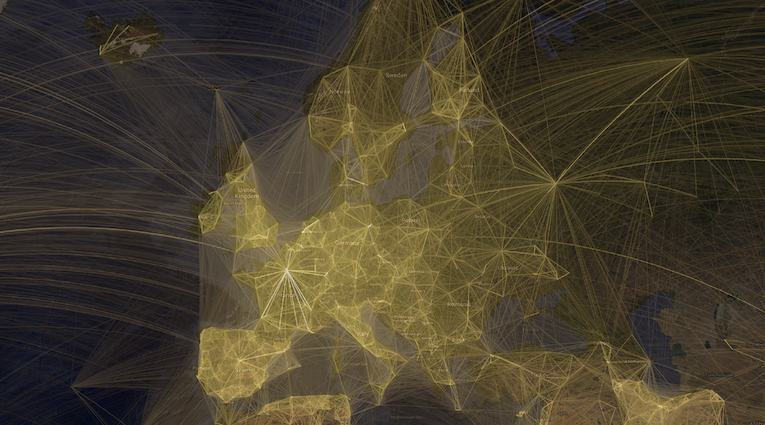
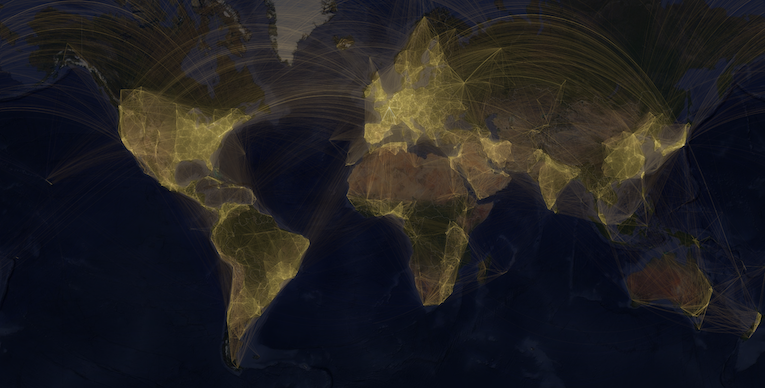

layout: true

```{r setup, include=FALSE}
source(here::here("R/slide-setup.R"))
```

<div class="my-footer">
<span>


</span>
</div> 

---

## What is collaboration?

-   Multiple people working on the same problem and exchanging ideas
-   People pooling expertise, time and resources to achieve a common goal

For example:

-   Two researchers jointly writing a paper
-   Several labs working on a problem together
-   Multi-site clinical studies in several countries

Collaboration can be organised at different levels:

-   Individuals
-   Departments
-   Institutions
-   Countries

---

## Why collaborate?

-   Sharing and discussing different perspectives and ideas leads to solutions more rapidly

-   Large undertakings require a joint effort: Many hands make light work

-   Teams with the best mix of competences

-   Access to specific material, equipment or know-how

-   Some projects need geographic distribution or capacity of parallel sites

-   Collaborations publish more and get more citations

-   Working together can be more motivating than solitary work

---

## Collaboration is widespread

.center[
```{r, out.height="80%", out.width="80%"}

```
]

.footnote[Image source from [here](http://olihb.com/2014/08/11/map-of-scientific-collaboration-redux/).]


---
## Collaboration is widespread

.center[
```{r, out.height="80%", out.width="80%"}

```
]

.footnote[Image source from [here](http://olihb.com/2014/08/11/map-of-scientific-collaboration-redux/).]

---

## Collaboration is widespread

.center[
```{r, out.height="80%", out.width="80%"}
knitr::include_graphics("../images/Resnet3.png")
```
]

.footnote[Image source from [here](http://olihb.com/2014/08/11/map-of-scientific-collaboration-redux/).]

---

## Collaboration is widespread

.center[
```{r, out.height="80%", out.width="80%"}
knitr::include_graphics("../images/Resnet4.png")
```
]

.footnote[Image source from [here](http://olihb.com/2014/08/11/map-of-scientific-collaboration-redux/).]

---

## Collaboration is based on agreement

Agreement is needed on:

-   Goals
-   Participants, their roles and responsibilities
-   Timing and deadlines
-   Commitment of time and resources
-   Expectations on quality
-   Data sharing, ownership, access
-   Intellectual property rights
-   Publication of results and authorships

--

==> *How to communicate about these issues*

---

## Collaboration happens at different places in the research workflow

.center[
```{r, out.height="60%", out.width="60%"}
knitr::include_graphics("../images/workflow.png")
```
]

--

Where in this research workflow can collaborative research methods be relevant?

---

class: center, middle

# Exercise: giving clear instructions

---

## Example: The first computationally reproducible manuscript

.center[
```{r, out.height="70%", out.width="70%"}
knitr::include_graphics("../images/elife.png")
```
]

.footnote[Source from https://elifesciences.org/articles/30274]

---

## Questions?
