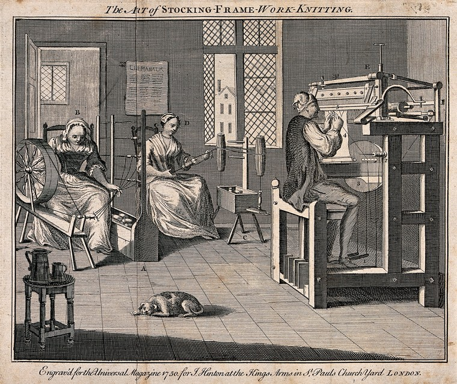
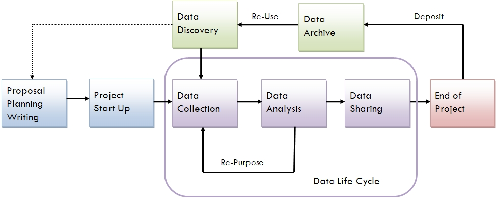
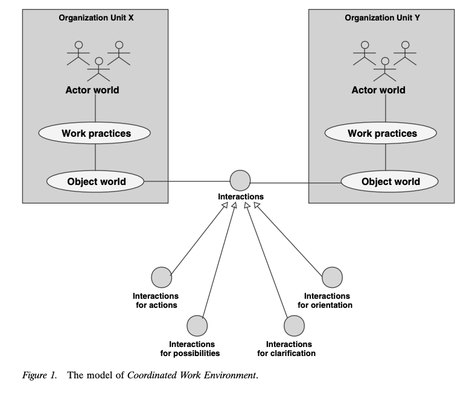
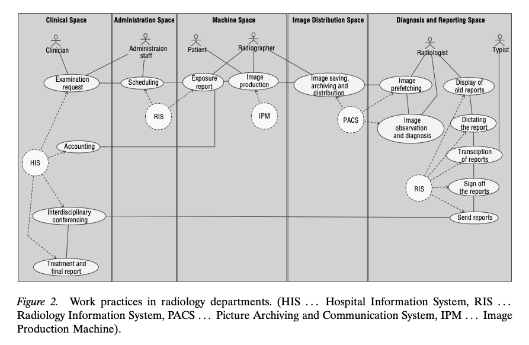
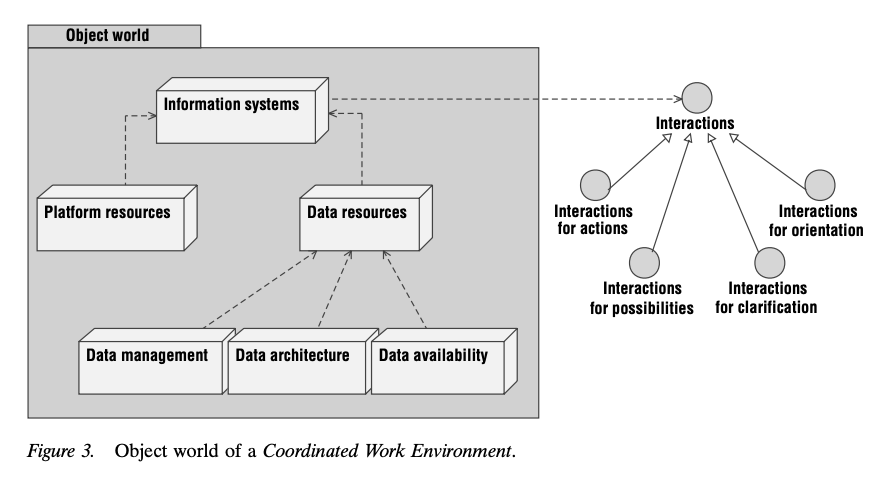
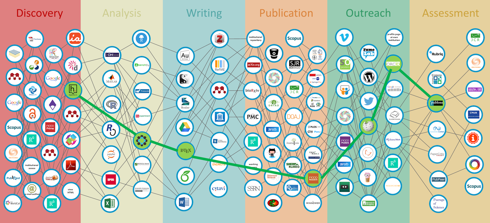

layout: true

```{r setup, include=FALSE}
source(here::here("R/slide-setup.R"))
```

---

## What is collaboration?

-   Multiple people working on the same problem and exchanging ideas
-   People pooling expertise, time and resources to achieve a common goal

.pull-left[
For example:
-   Two researchers jointly writing a paper
-   Several labs working on a problem together
-   Multi-site clinical studies in several countries
]

---

## What is collaboration?

-   Multiple people working on the same problem and exchanging ideas
-   People pooling expertise, time and resources to achieve a common goal

.pull-left[
For example:
-   Two researchers jointly writing a paper
-   Several labs working on a problem together
-   Multi-site clinical studies in several countries
---
Collaboration can be organised at different levels: Individuals,
Departments, Institutions, Countries
]

.pull-right[
```{r, out.height="80%", out.width="80%"}
knitr::include_graphics("../images/LHC.jpg")
```
]

.footnote[[Image from CERN](https://cds.cern.ch/images/CERN-EX-0510029-03).]

---

## Collaboration is the consequence of specialisation

- Increasing complexity of the research work flow
- Specialisation in research tasks

.pull-left[
```{r, out.height="75%", out.width="75%"}

```
]

.pull-right[
```{r, out.height="90%", out.width="90%"}
knitr::include_graphics("../images/Powerloom.jpg")
```
]

.footnote[Figure: [Spinners and stocking makers](https://wellcomecollection.org/works/r9h5us6f) and [Powerloom Weavers](https://en.wikipedia.org/wiki/Industrial_Revolution#/media/File:Powerloom_weaving_in_1835.jpg).]

---

## Why do researchers collaborate?

-   Sharing and discussing different perspectives and ideas leads to solutions more rapidly

-   Large undertakings require a joint effort: Many hands make light work

-   Teams with the best mix of competences

-   Access to specific material, equipment or know-how

-   Some projects need geographic distribution or capacity of parallel sites

-   Collaborations publish more and get more citations

-   Working together can be more motivating than solitary work

---

## The research workflow

.center[
```{r, out.height="70%", out.width="70%"}

```
]

.footnote[[Diagram Source: University of Virginia Library](https://guides.lib.virginia.edu/c.php?g=515290&p=3522215)]

---

## Collaboration in the research workflow

.center[
```{r, out.height="60%", out.width="60%"}
knitr::include_graphics("../images/collaboration_cycle.png")
```
]

.footnote[[Tellioglu, Hilda. (2008). Collaboration life cycle. 357 - 366. 10.1109/CTS.2008.4543951. ](https://ieeexplore.ieee.org/document/4543951?arnumber=4543951).]

---

## Collaboration throughout the research cycle: Initiation

Agreement is needed on:
-   Goals
-   Participants, their roles and responsibilities
-   Timing and deadlines
-   Commitment of time and resources
-   Expectations on quality
-   Data sharing, ownership, access
-   Intellectual property rights
-   Publication of results and authorships

---

## Collaboration throughout the research cycle: Initiation

Agreement is needed on:
-   Goals
-   Participants, their roles and responsibilities
-   Timing and deadlines
-   Commitment of time and resources
-   Expectations on quality
-   Data sharing, ownership, access
-   Intellectual property rights
-   Publication of results and authorships

==> **Need to communicate clearly about these issues**

==> **Need to clearly document agreements and expectations**

---

## Collaboration in the research workflow: Operation

.center[
```{r, out.height="60%", out.width="60%"}
knitr::include_graphics("../images/collaboration_cycle.png")
```
]

.footnote[[Tellioglu, Hilda. (2008). Collaboration life cycle. 357 - 366. 10.1109/CTS.2008.4543951. ](https://ieeexplore.ieee.org/document/4543951?arnumber=4543951).]

---

## Collaboration in the research workflow: Operation

.center[
```{r, out.height="70%", out.width="70%"}
knitr::include_graphics("../images/workflow.png")
```
]

.footnote[[Diagram by Pilip Guo](https://cacm.acm.org/blogs/blog-cacm/169199-data-science-workflow-overview-and-challenges/fulltext).]

---
## The Coordinated Work Environment

.center[
```{r, out.height="40%", out.width="50%"}

```
]

.footnote[Figure from [Tellioglu, Hilda (2003). The Journal of Supercomputing, 24, 161–171, 2003](https://link.springer.com/article/10.1023/A:1021750826139).]

---
## The Coordinated Work Environment

.center[
```{r, out.height="50%", out.width="60%"}

```
]

.footnote[Figure from [Tellioglu, Hilda (2003). The Journal of Supercomputing, 24, 161–171, 2003](https://link.springer.com/article/10.1023/A:1021750826139).]

---
## The Coordinated Work Environment

.center[
```{r, out.height="60%", out.width="70%"}

```
]

.footnote[Figure from [Tellioglu, Hilda (2003). The Journal of Supercomputing, 24, 161–171, 2003](https://link.springer.com/article/10.1023/A:1021750826139).]

---
## Tools for creating a suitable Coordinated Work Environment

.center[
```{r, out.height="90%", out.width="90%"}

```
]

.footnote[Figure from [Innovations in Scholarly Communication](https://101innovations.wordpress.com/workflows/).]

---
## Summary

- Collaboration is central to modern science

- Enormous variation in scale and scope

- Central aim: Efficient coordination

- Takes place at every stage of the research cycle

- Central tools:
    - Good communication
    - Agreement not just on goals but on process:
      - The Coordinated Work Environment 
    - Structured documentation
