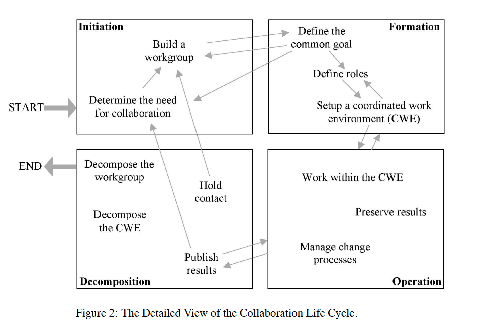
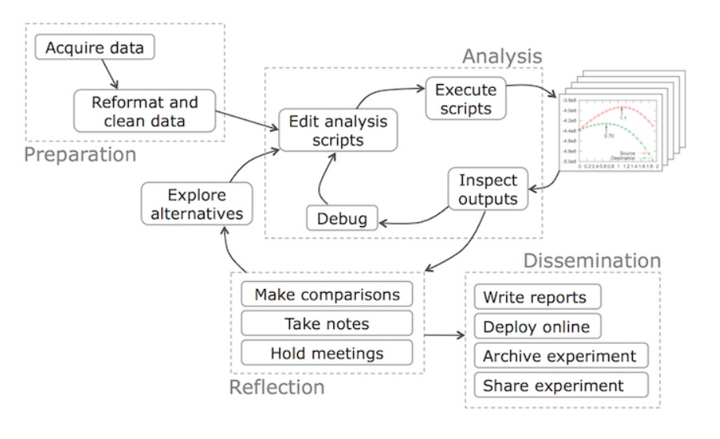

layout: true

```{r setup, include=FALSE}
source(here::here("R/slide-setup.R"))
```

```{r}
xaringanExtra::use_progress_bar(color = progress_bar_colour, location = "top")
```

---

## Forming groups to collaborate on research projects

???

Collaboration has increasingly become a required activity of doing science. Maybe
in the past you could do good science on your own, but not anymore. We're more
and more getting into an era of team-based science, with specialists to handle
multiple areas of a project, with teams that can sometimes span multiple
countries and timezones.

Collaborating on projects means you need to form a group of some type. There's
a fair amount of research on the various phases of collaboration.

--

.pull-left[
```{r, out.height="100%", out.width="100%"}

```
]

.pull-right[
**Start of group is important phase**:

- Consider how humans behave in groups (example: resolving conflicts or disagreements)
- Communicating clearly about things like expectations (example: this course's
Code of Conduct and syllabus)
- *Written* agreements! About ownership, sharing, IP, authorship, publication, etc
- And... *how* to work together
]

.footnote[Image from: `r Cite(bib, "Tellioglu2008")`]

???

(Go over image.)

I would say one of the most important phases is this initial phase when you are
just starting out. This is exactly when you need to establish boundaries,
how you deal with disagreements, deciding on formal written agreements like
ownership, publishing, etc.
But I think an overlooked part of that is *how* you work together. I think there's
an implicit assumption that you'll work together by emailing around word documents.
Because that's how we've basically been taught during university, and it continues
like that.
But we should be critical of this assumption. Is that correct to think that? 
Are there better ways?

---

## Activity: Think `r emo::ji("thought_balloon")` than discuss `r fontawesome::fa("far fa-comments")`

- For 2 minutes, think back to collaborations you've had and consider:
    - What worked well and why
    - Some struggles you've had, what didn't work so well, and why
    - *How* you actually collaborated. Was it mostly discussing things
    together? Did you distribute tasks? How did you coordinate your documents,
    your work, your tasks?
    
- In your group, share what you've thought
    - Each person has 2 minutes (instructor will set time)
    
- After, we'll share some of the thoughts

---

## How and where to collaborate when the research workflow has many parts

.center[
```{r, out.height="65%", out.width="65%"}

```
]

.footnote[[Diagram by Philip Guo.](https://cacm.acm.org/blogs/blog-cacm/169199-data-science-workflow-overview-and-challenges/fulltext)]

???

How do you decide who does what? How do you decide what you all use to do the tasks?
For instance, how do you take notes for meetings and how do you share those notes?
When you run analyses and have discussions with your collaborators, how do you
share those analyses or how do you work together on them? There are so many more
questions, because... (next slide)

---

## MANY tools for doing research... how do you coordinate and decide when collaborating?

.center[
```{r, out.height="72%", out.width="72%"}
knitr::include_graphics("../images/tools-workflow.png")
```
]

.footnote[Image from: `r Cite(bib, "Bosman2017")`]

---

class: middle

## We'll teach you one powerful way of collaborating: Git and GitHub!

.footnote[Though it can often be difficult to learn `r emo::ji("cry")`]

---

# References

```{r refs, results="asis", echo=FALSE}
PrintBibliography(bib)
```
