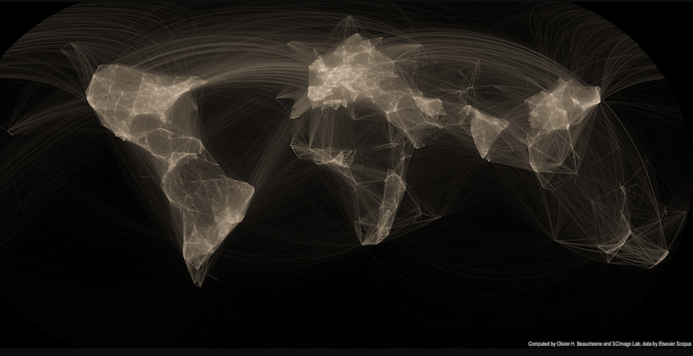
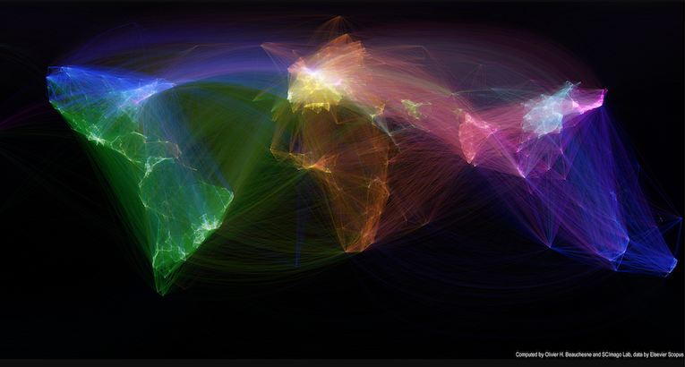
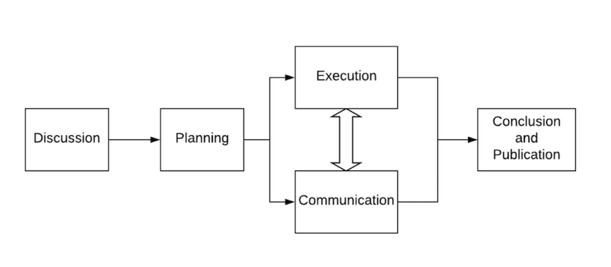
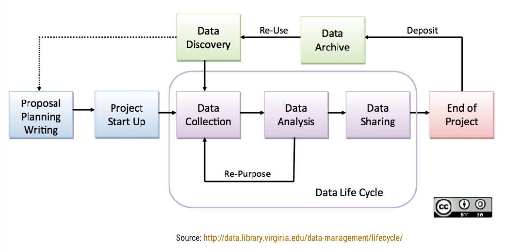

layout: true

```{r setup, include=FALSE}
source(here::here("R/slide-setup.R"))
```

---

## What is collaboration?

-   Multiple people working on the same problem and exchanging ideas
-   People pooling expertise, time and resources to achieve a common goal

For example:
.pull-left[
-   Two researchers jointly writing a paper
-   Several labs working on a problem together
-   Multi-site clinical studies in several countries
]

---

## What is collaboration?

-   Multiple people working on the same problem and exchanging ideas
-   People pooling expertise, time and resources to achieve a common goal

For example:
.pull-left[
-   Two researchers jointly writing a paper
-   Several labs working on a problem together
-   Multi-site clinical studies in several countries
---
Collaboration can be organised at different levels:
-   Individuals
-   Departments
-   Institutions
-   Countries

]

.pull-right[
```{r, out.height="80%", out.width="80%"}
knitr::include_graphics("../images/LHC.jpg")
```
]

.footnote[[Image from CERN](https://cds.cern.ch/images/CERN-EX-0510029-03).]


---

## Why collaborate?

-   Sharing and discussing different perspectives and ideas leads to solutions more rapidly

-   Large undertakings require a joint effort: Many hands make light work

-   Teams with the best mix of competences

-   Access to specific material, equipment or know-how

-   Some projects need geographic distribution or capacity of parallel sites

-   Collaborations publish more and get more citations

-   Working together can be more motivating than solitary work


---

## Collaboration is widespread

.center[
```{r, out.height="80%", out.width="80%"}

```
]

.footnote[Image source from [here](http://olihb.com/2014/08/11/map-of-scientific-collaboration-redux/).]


---

## Collaboration is widespread

.center[
```{r, out.height="75%", out.width="75%"}

```
]

.footnote[Image source from [here](http://olihb.com/2014/08/11/map-of-scientific-collaboration-redux/).]

---

## Collaboration in the research workflow

.center[
```{r, out.height="60%", out.width="60%"}
knitr::include_graphics("../images/collaboration_cycle.png")
```
]

.footnote[[Tellioglu, Hilda. (2008). Collaboration life cycle. 357 - 366. 10.1109/CTS.2008.4543951. ](https://ieeexplore.ieee.org/document/4543951?arnumber=4543951).]


---

## Collaboration is based on agreement

Agreement is needed on:
-   Goals
-   Participants, their roles and responsibilities
-   Timing and deadlines
-   Commitment of time and resources
-   Expectations on quality
-   Data sharing, ownership, access
-   Intellectual property rights
-   Publication of results and authorships

---

## Collaboration is based on agreement

Agreement is needed on:
-   Goals
-   Participants, their roles and responsibilities
-   Timing and deadlines
-   Commitment of time and resources
-   Expectations on quality
-   Data sharing, ownership, access
-   Intellectual property rights
-   Publication of results and authorships

==> **Need to communicate clearly about these issues**

==> **Need to clearly document agreements and expectations**

---

## Collaboration in the research workflow

.center[
```{r, out.height="60%", out.width="60%"}
knitr::include_graphics("../images/collaboration_cycle.png")
```
]

.footnote[[Tellioglu, Hilda. (2008). Collaboration life cycle. 357 - 366. 10.1109/CTS.2008.4543951. ](https://ieeexplore.ieee.org/document/4543951?arnumber=4543951).]


---

## Collaboration in the research workflow

.center[
```{r, out.height="70%", out.width="70%"}

```
]

.footnote[[Diagram by Pilip Guo](https://cacm.acm.org/blogs/blog-cacm/169199-data-science-workflow-overview-and-challenges/fulltext).]


---

## Collaboration in the research workflow

.center[
```{r, out.height="70%", out.width="70%"}

```
]

.footnote[[Diagram Source](https://data.library.virginia.edu/data-management/lifecycle/).]


---

## Summary
- Collaboration is central to modern science
- Enormous variation in scale and scope

- Central point: efficient coordination

- Central tools: good communication and structured documentation

---

## Questions?
