layout: true

```{r setup, include=FALSE}
source(here::here("R/slide-setup.R"))
```

---

## Where is Open Data in the Open Science Universe?

- Open data is only a small part of the open science movement

.center[
```{r, out.height="80%", out.width="80%"}
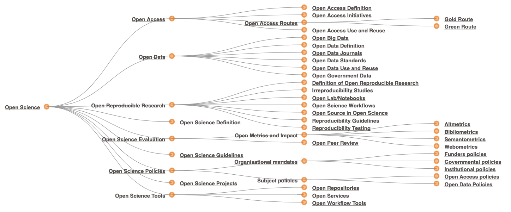
```
]

.footnote[Image source from Foster Open Science [(www.fosteropenscience.eu/resources)](https://www.fosteropenscience.eu/resources).]


---

## Open Data Principles

.pull-left[
- Open data is not only about datasets you can download from the internet

- Accessibility is only one part of Openness

]


.footnote[
[1] Go FAIR Initiative (https://www.go-fair.org/fair-principles/)
]


---

## Open Data Principles

.pull-left[
- Open data is not only about datasets you can download from the internet

- Accessibility is only one part of Openness

- Open data should be FAIR[1]:
  - Findable
  - Accessible
  - Interoperable
  - Reusable
]

.pull-right[
```{r, out.height="80%", out.width="80%"}
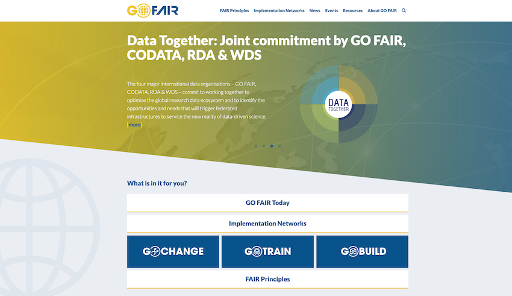
```
]


.footnote[
[1] Go FAIR Initiative (https://www.go-fair.org/fair-principles/)
]

---

## FAIR data[1]

- **Findable**:
  The first step in (re)using data is to find them. Metadata and data should be easy to find for both humans and computers.

- **Accessible**:
  Once the user finds the required data, she/he needs to know **how** can they be accessed, possibly including authentication and authorisation.

- **Interoperable**:
  The data usually need to interoperate with applications or workflows for analysis, storage, and processing. (Meta)data should use a formal, accessible, shared language or format

- **Reusable**:
  Data and metadata should be well-described so that they can be replicated and/or combined in different settings.


.footnote[
[1] Go FAIR Initiative (https://www.go-fair.org/fair-principles/)
]


---

## Finding Open data

- Starting points:
    - Data Resources known in your network
    - Publication with link to data source / repository
    - Search in public repositories

---

## Known data resources

- Wide range of options between fully closed and fully open (FAIR)
    - Closed

---

## Known data resources

- Wide range of options between fully closed and fully open (FAIR)
    - Closed
.pull-right[
```{r, out.height="90%", out.width="90%"}
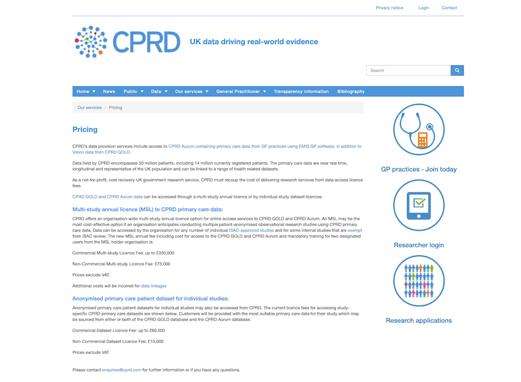
```
]
    - Commercial / Paid access 
        - e.g. [(CPRD)](https://www.cprd.com/)

---

## Known data resources

- Wide range of options between fully closed and fully open (FAIR)
    - Closed
    - Commercial / Paid access 
        - e.g. [(CPRD)](https://www.cprd.com/)
    - Data sharing within a project/collaboration (restricted)
    
---

## Known data resources

- Wide range of options between fully closed and fully open (FAIR)
    - Closed
.pull-right[
```{r, out.height="90%", out.width="90%"}
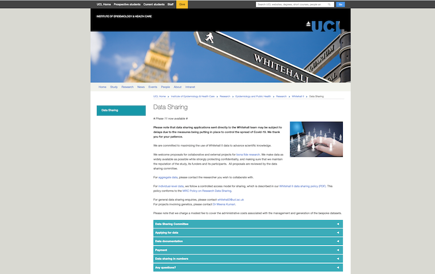
```
]
    - Commercial / Paid access 
        - e.g. [(CPRD)](https://www.cprd.com/)
    - Data sharing within a project/collaboration (restricted)
    - Gated Data Sharing (Application + Evaluation of proposal, processing fee)
        - e.g. Whitehall II Study [(Whitehall II Study)](https://www.ucl.ac.uk/epidemiology-health-care/research/epidemiology-and-public-health/research/whitehall-ii/data-sharing)

---

## Known data resources

- Wide range of options between fully closed and fully open (FAIR)
    - Closed
.pull-right[
```{r, out.height="90%", out.width="90%"}
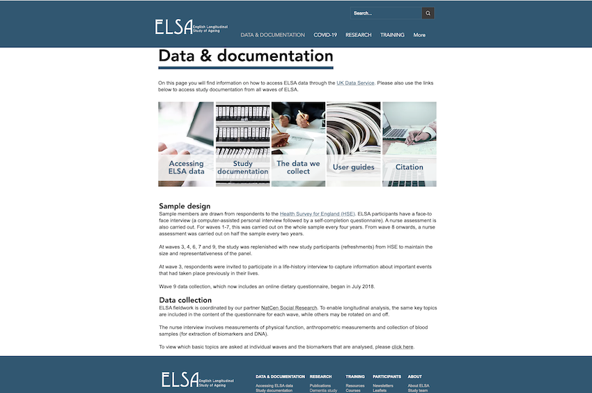
```
]
    - Commercial / Paid access 
        - e.g. [(CPRD)](https://www.cprd.com/)
    - Data sharing within a project/collaboration (restricted)
    - Gated Data Sharing (Application + Evaluation of proposal, processing fee)
        - e.g. Whitehall II Study [(Whitehall II Study)](https://www.ucl.ac.uk/epidemiology-health-care/research/epidemiology-and-public-health/research/whitehall-ii/data-sharing)
    - Only registration required
        - e.g. English Longitudinal Study of Ageing [(ELSA)](https://www.elsa-project.ac.uk/data-and-documentation) accessible via the [(UK Data Service)](https://ukdataservice.ac.uk/)

---

## Known data resources

- Wide range of options between fully closed and fully open (FAIR)
    - Closed
.pull-right[
```{r, out.height="90%", out.width="90%"}
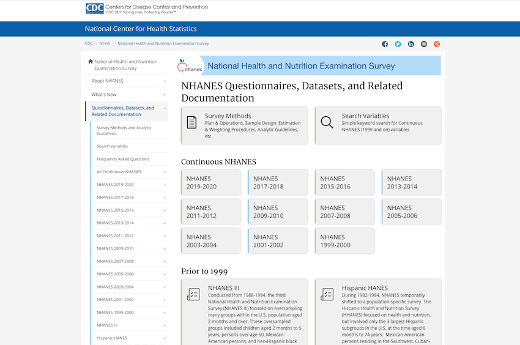
```
]
    - Commercial / Paid access 
        - e.g. [(CPRD)](https://www.cprd.com/)
    - Data sharing within a project/collaboration (restricted)
    - Gated Data Sharing (Application + Evaluation of proposal, processing fee)
        - e.g. Whitehall II Study [(Whitehall II Study)](https://www.ucl.ac.uk/epidemiology-health-care/research/epidemiology-and-public-health/research/whitehall-ii/data-sharing)
    - Only registration required
        - e.g. English Longitudinal Study of Ageing [(ELSA)](https://www.elsa-project.ac.uk/data-and-documentation) accessible via the [(UK Data Service)](https://ukdataservice.ac.uk/)
    - No registration required
        - e.g. [(NHANES)](https://wwwn.cdc.gov/nchs/nhanes/)

---

## Finding Open data

- Starting points:
    - Data Resource known in your network
    - Publication with link to data source / repository
    - Search in public repositories

---

## Publications with links to data

Journals increasingly encourage publication of (links to) data

Let's have a look at the PLOS journals:

- Policy requiring researchers to share the data underlying their results or to state why this is not possible
- But: Are authors complying with these requirements? [(PLOS Medicine: Diabetes)](https://journals.plos.org/plosmedicine/search?filterJournals=PLoSMedicine&filterSubjects=Medicine+and%20health%20sciences&filterArticleTypes=Research%20Article&q=diabetes&page=1)

---

## Publications with links to data

Journals increasingly encourage publication of (links to) data

Let's have a look at the PLOS journals:

- Policy requiring researchers to share the data underlying their results or to state why this is not possible
- But: Are authors complying with these requirements? [(Review by Federer et al)](https://journals.plos.org/plosone/article?id=10.1371/journal.pone.0194768)
.center[
```{r, out.height="85%", out.width="85%"}
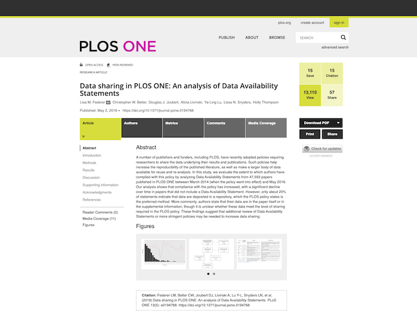
```
]

---

## Review of PLOS data statements (Federer 2018)

.center[

]

---

## Finding Open data

- Starting points:
    - Data Resource known in your network
    - Publication with link to data source / repository
    - Search in public repositories

---

## Figshare

[Figshare: Diabetes](https://figshare.com/search?q=diabetes&sortBy=posted_date&sortType=desc&licenses=1,2,47,52,3,40,49&itemTypes=3&categories=7,48)
.center[
```{r, out.height="90%", out.width="90%"}
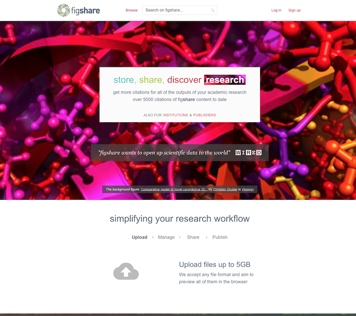
```
]

---

## Dryad

[Dryad: Diabetes](https://datadryad.org/search?utf8=%E2%9C%93&q=diabetes)
.center[
```{r, out.height="90%", out.width="90%"}
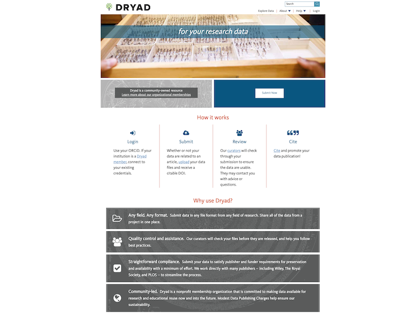
```
]

---

## Github Collection 

[Github: Awesome Public Datasets](https://github.com/awesomedata/awesome-public-datasets)
.center[
```{r, out.height="90%", out.width="90%"}
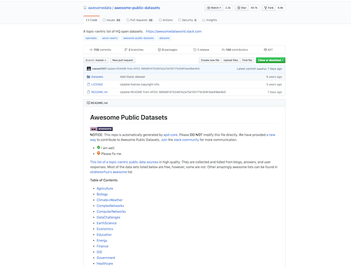
```
]

---

## Rigsarkivet (Overview and access info)

[Rigsarkivet: Sundhed](https://www.sa.dk/da/forskning-rigsarkivet/rigsarkivet-sundhed/)
.center[
```{r, out.height="90%", out.width="90%"}
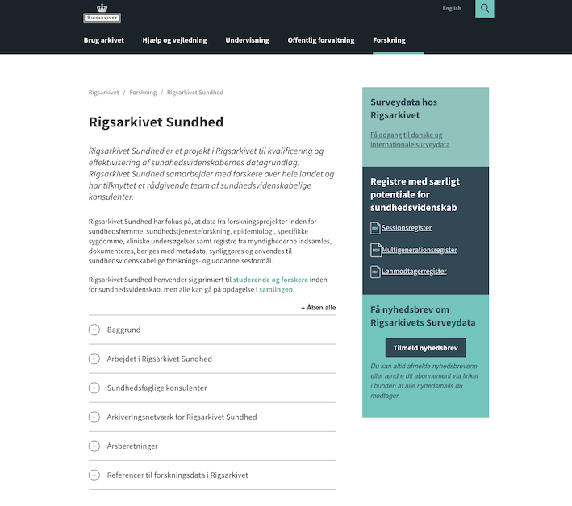
```
]

---

## Open Neuro (MRI and fMRI images)

[Openneuro: Diabetes](https://openneuro.org/search/diabetes)
.center[
```{r, out.height="90%", out.width="90%"}
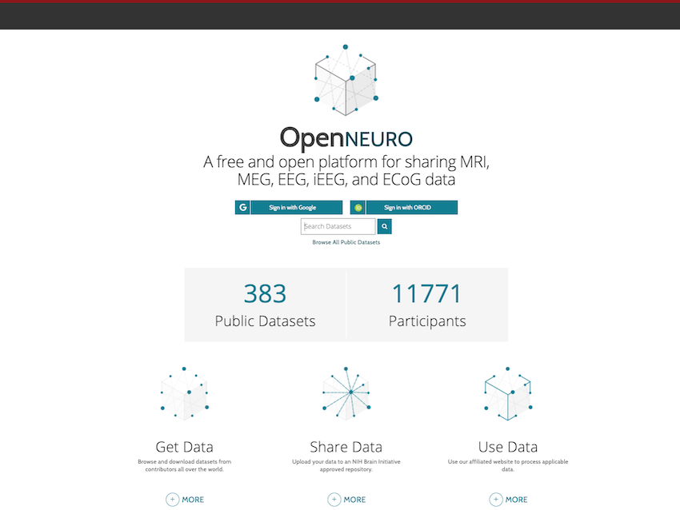
```
]

---

## How are you allowed to use data you find?

- First important step: know who 'owns' the data and what they allow you to do with it
    - Public Domain: There is no owner, you are allowed to use the data in any way
    - Data are protected by copyright: but the owner gives you a license to use it in a certain way
  
- Different Open Licenses

.pull-left[
```{r, out.height="70%", out.width="70%"}
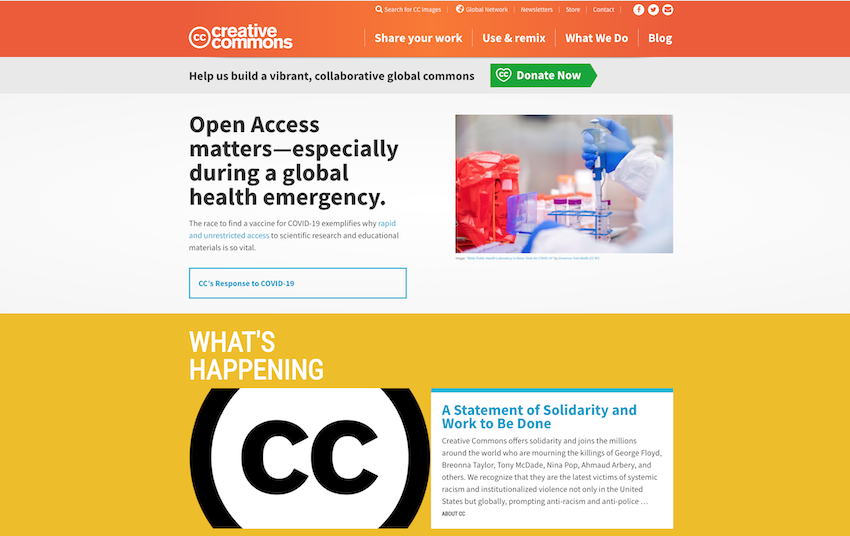
```
]

.pull-right[
```{r, out.height="30%", out.width="30%"}
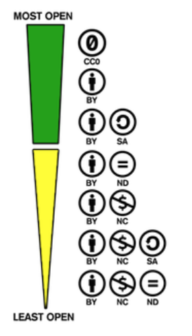
```
]

---

## Different Open Licenses

.pull-left[
For any type of 'work', including databases:

- Creative Commons:
    - CC BY-NC (Attribution-NonCommercial)
    - CC BY-ND (Attribution-NoDerivatives)
    - CC BY-SA (Attribution-ShareAlike)
    - CC-BY (only Attribution required)
    - CC0 (= placing something in the public domain)
- Open Data Commons Licenses:
    - ODC-By (Attribution required)
    - PDDL (= placing a database in the public domain)
]
.pull-right[
Mostly for Open Source Software:

- GNU
- MIT
]

Finding a suitable license for your data: [(Choose a license)](https://choosealicense.com/) or [(Creative Commons Chooser)](https://chooser-beta.creativecommons.org/)

---

## Summary

- Open Data is only a part of the Open Science Universe
- Open Data should be FAIR (but are often only in part)
- There are many different ways of finding Open Data, none are ideal (yet)
- Be mindful of the licence attached to a dataset

---

## Links and references

.pull-left[
**General Resources**
- [Go Fair] (International initiative to promote FAIR data)
- [Foster Open Science] (EU project with general resources on Open Science)
- [Open Science Framework] (Resources for Open Science)
- [Center for Open Science] (Resources for Open Science)

]

.pull-right[
**Data Repositories**
- [Dryad] (Mostly Manuscript-linked)
- [Figshare] (Mostly Manuscript-linked)
- [European Data Portal] (Mostly high aggregation level)
- [NIH data repositories] (Links to topic specific repositories)
- [YODA project] (Request access to RCT data)
- [Project Datasphere] (Cancer Research databases)
- [Nature recommended data repositories]
- [ClinicalStudyDataRequest] (Request access to RCT data)
]

---

class: center

# Thank you!

[Open Science Framework]: https://osf.io/
[European Data Portal]: https://www.europeandataportal.eu/
[GitHub]: https://github.com/
[Dryad]: https://datadryad.org/
[Figshare]: https://figshare.com/
[Center for Open Science]: https://cos.io/
[Choose a License]: https://choosealicense.com/
[Creative Commons]: https://creativecommons.org/
[Go Fair]: https://www.go-fair.org/fair-principles/
[EU Turning FAIR into reality]: https://ec.europa.eu/info/sites/info/files/turning_fair_into_reality_0.pdf
[Plan S]: https://www.coalition-s.org/
[Foster Open Science]: https://www.fosteropenscience.eu/
[NIH data repositories]: https://www.nlm.nih.gov/NIHbmic/nih_data_sharing_repositories.html
[UK Data Archive]: https://data-archive.ac.uk/find/archive-catalogue
[YODA project]: https://yoda.yale.edu/
[Project Datasphere]: https://www.projectdatasphere.org/projectdatasphere/html/home
[ClinicalStudyDataRequest]: https://www.clinicalstudydatarequest.com/
[Nature recommended data repositories]: https://www.nature.com/sdata/policies/repositories

???
Finding and Obtaining Open Datasets - Lecture Notes

In this section we will look at some practical ways to find and access open data. This introduction is by no means exhaustive but will help you find datasets that you can use to train your data wrangling and analysis skills, check the reproducibility of published papers and even to conduct original research. Along the way we will see how researchers and institutions are currently publishing data sets and analytical code. We will also see that the situation is not as good as it could be.

To start with, it is worth pointing out that accessible data is only one part of a wider set of principles guiding open and reproducible science.

As you can see on Slide 2, Open Science also encompasses open access publication, open reproducible research, open science tools (such as R) and higher level principles such as open science evaluation and open science policies. We will touch on several of these branches in this course, but at this point the focus is on open and accessible data.

When people think of Open data, their first thought is often whether the data can be downloaded from the internet. However, this is only one part (accessibility) of the four key components of Open Data.

In order for data to be Open, it needs to be FAIR: Findable, Accessible, Interoperable and Reusable. Let’s explore these components.

Data can only be findable if it is indexed somewhere by a search engine or repository. In an ideal situation, somebody who searchers for any feature of the data should find it. This requires for each data element (for example a variable, but also a whole dataset) to have a Universally Unique Identifier (UUI), which is linked to contextual and searchable metadata (data about data). Contextual metadata can exist at different levels, ranging from the dataset as a whole, to individual variables. The contextual part refers to the circumstances (context) in which each variable and the whole dataset was created.

Let’s imagine what type of metadata would be relevant to have at the level of a dataset. For example: how the dataset was generated (study design, source population, invitation process, response rates, informed consent). At the level of variables, contextual metadata could describe what each variable represents, how the measurement was obtained or derived (e.g. which equipment was used, what the quality control features were) and which data cleaning, processing and interpretation steps have already been taken, when, by whom and with which aim/perspective. In effect, ideally the meta-data should provide all the information you need to decide whether the variable is suitable for your research purpose, as well as all the necessary background to use it comfortably. Some of these points also relate to Reusability, which we will come to a bit later.

But there is an added layer to the expectations we should have for findability and the contextual metadata needed for this. Datasets should be findable not only by humans, but also by machines. This means that the meta-data should preferably not only be available in prose / natural language, but also in machine-readable formats (standardised codes and ontologies).

The second part of the FAIR acronym is for Accessibility, which means: What steps do you need to go through in order to actually get a copy of the data? Can you just download it from an online repository, or do you need to apply for access? Do you need to pay for access? We will have a closer look at some of the different access models a bit later on.

The I in FAIR is for Interoperability. This means that the data and metadata should be in a format that can be used by different researchers with different tools. For example, it means that the data should not be in a format that forces you to use software owned by one particular company, including having to have a licence for that software. A very simple example of an interoperable way of formatting data is to use a CSV file (comma separated file), which stores the raw data in the most simple way possible. When datasets become more complex, for example when there are multiple tables that are related to each other, an open format can for instance XML where the description of the database and the structure of the database is included in a format file as an XML schema that tells software how the database is structured. There are some formats that have an intermediate form with regard to interoperability, such as for example SAS, SPSS and Stata database formats. These formats are not directly interoperable since they are specific for the respective statistical packages, but their structure (schema) is known and can be used to transfer the data from one format to the other. Generally these formats are remnants of closed approaches in the past that have gradually been opened. Finally there are unfortunately still many data in fully proprietary formats, which means that a company, university, or other organisation owns the only software that can be used to access data in their particular format. They do this by keeping the data schema secret and the data encrypted in such a way that it can only be accessed by using the software they provide. Many companies used to do this, including all the usual statistical packages and even word processors and spreadsheets, but over the past decades most of these formats have been reverse engineered and finally been made public. However, you we still encounter a lot of closed, non-interoperable data formats, mostly in software tied directly to measurement hardware. For example, many of the commercial accelerometers targeted at consumers will store the raw data they collect in a proprietary format, and only make a highly processed subset or summary of the data accessible to users. This means that these devices are of limited use for investigators who are interested in using all the collected data. Closed formats are also often seen in software linked to imaging and other measurement hardware. 

But, it is not only companies that sometimes choose to close their formats and thereby make their data schemas non-interoperable. In the diabetes field the clearest example is the HOMA-2 model, which has been developed by Oxford University but has never been published. The university makes an online tool available that you can freely use to calculate HOMA-2, but the algorithm behind it is proprietary, which means that the only way to obtain HOMA-2 values is by using their website.

Moving on to the R in FAIR, which is for Reusability. Reusability answers the question of whether you have all the information you need to assess whether you want, can and are allowed to (re)use the data for a different purpose. This has to do partially with having rich and descriptive metadata that tells you what the dataset contains (described under Findability), but also with information about the licences, permissions and procedures govern the dataset. This should allow you to assess whether the data owner allows the dataset to be used for the purposes you have in mind, under which conditions, and which commitments you make to acknowledgement of the datasource.

You may have noticed that the FAIR structure talks about principles and that it does not impose or suggest any specific implementation or technology. FAIR principles also don’t dictate that data should be in the public domain; most FAIR data do have a data owner and will be governed by a license. We will see how this works a bit later on.

Let’s start now on the practical aspects, starting with the first part: Finding data. On the slide you will see some of the starting points for finding data we often encounter. The easiest starting point is actually close to home: in your own research network. You may know of datasets that other researchers have collected. For example, perhaps you hear an interesting talk at a conference and you think: I could do something interesting with that dataset and after the presentation you talk to the researcher and ask about getting access to their data. Or perhaps your supervisor tells you: There's this cool data set out there, email XX and they will give you access. This is very much the traditional way of finding data and even though it is very focused, it is not scalable.

A second approach starts with a publication which uses data that you find interesting and makes the dataset available through a public repository. We will look into this option a bit more, as it is used increasingly. There are some journals, for instance eLife, that require that data are made available where possible. The PLOS journals require that all authors indicate how the data underlying each publication can be accessed. This can currently still be through contacting the authors, but many authors upload the datasets to repositories and provide a link in the paper. So one search strategy could be to start with publications that you find interesting, check the data access statement and access the data through the linked repositories. This approach already sounds better than through networks but we will see that there are still some disadvantages and many limitations.

The third approach would be to search directly through the repositories for key words linked to the topics that you are interested in. This also sounds like an attractive approach, but unfortunately there are dozens of repositories and lists of repositories ranging from very general ones to ones focused exclusively on a very specific field. There are even search engines to find good lists of places to find open data. It means that you may have to search repeatedly from different starting points to identify a suitable open and accessible dataset.

When you find a dataset that is suitable, the next practical question is: What do I need to do to get access. Also here, there is a wide range of options from closed to fully open (FAIR). Closed data is the traditional status. It basically means that you don’t have access unless you’re part of the research group or company that owns and holds the data. We won’t talk about this option too much.

Then there are databases that you can buy access to: commercial access. An example is the CPRD, the Clinical Practice Research Datalink. This is a database that collects de-identified patient data from a network of General Practices in the UK, managed by the UK Medicines and Healthcare products Regulatory Agency. Researchers can buy access to the database on a commercial basis.

If we go to their webpage and click through to the page that outlines their pricing structure, you can see that it costs £ 330,000 to get a multiple access license to run multiple projects on this database. So that puts it beyond the scope of most PhD projects and even beyond the scope of most research institutes. It's really mostly pharmaceutical companies that access databases like this.

The next one is data sharing within a collaboration or within a project. As we saw before, this is the traditional way of doing things; for example after your supervisor told you to contact research group XX. In this format you and your collaborators all know each other and have either informal (oral) or semiformal (emails) agreements on how you will get the data and how you are expected to work with it. This model of data sharing is still restricted, because you have to be part of the collaboration in order to access the data. Even though this is still very common practice, it is a model we would like to start moving away from. 

The next model is called gated data sharing. In this model the database is accessible in principle also to people outside the research group that collected the data, but they have to approve your application. For instance, a dataset that I have worked with for several years at UCL in London, the Whitehall II cohort, uses this model. They have a very clearly defined data sharing policy, which is published on their website. As you can see, they indicate that access is for bonafide (honest) research questions. This means that you need to write out a data application, indicating what your aim is, which variables you want to use and giving a bit of background about your research experience, prior publications and the institution you are affiliated with. This application is then discussed in a committee of professors and researchers from the Whitehall study team, and they decide whether it fulfils their criteria for data sharing. That is the gated part, and the study’s researchers are the gate-keepers deciding who can have access. In this format there is no requirement for you to collaborate with the original researchers, although many still do as they have extensive experience in the structure and peculiarities of the data. In the case of the Whitehall II cohort there is an administrative fee, but at £500 it is much lower than the CPRD and is only meant to cover the costs the team makes in processing the applications and making the specific data selection for your project.

Then there are examples of data sets where only registration is required; where there is no committee to judge whether your application is good enough, but you still have to register who you are and what you want to do with the data. You also have to sign some level of data sharing agreement where you commit to using and storing the data safely, securely, and to not trying to contact the participants. An example of this model is the ELSA study, another UK cohort study, that has archived its data on the UK data service, which is a data archive for the UK. On the website you make an account, submit a short description of the project and then you can download the entire data set. You don't need to select variables. It takes about a week to 10 days to get through the process of approval and get the complete dataset. This solution is a lot better than the previous ones, because it does not depend on committee approval, but in a lesser way it is still gated.

A similar procedure applies to obtaining data from one of the largest data sources, the UK biobank. This is a dataset with extensive measurements on more than half a million participants, including full GWAS data and quite detailed phenotypes. In order to obtain UK biobank data you also need to submit an application with a project description, and pay a processing fee and commit to a data transfer agreement. But the evaluation process does not consider the academic merits of your application or whether a different group may already be looking at this question.

Finally, there is a totally open model, which means that you can just download micro-data (individual-level data in the case of human cohorts/surveys) from an online repository without a need to register or sign agreements. This model is much more usual outside the medical sciences (e.g. astronomy, geology, biology, economics, physics), where there are no issues around GDPR or privacy of individual participants.

But also in medical sciences and epidemiology it is increasingly possible to find datasets that can simply be downloaded in a totally open model. An example is a dataset you will be using today, the NHANES data. The dataset you will use today is a cleaned up version made specifically for teaching purposes and incorporated into the NHANES package in R, but you can go on to the National Institutes of Health (NIH) website and see a complete list of all the questionnaires, all the different data waves and download the parts you are interested in using here and now. Of course, in practice you will find that downloading the data is only a first and perhaps the easiest step. Before you can really start working with the data you will need to find and read a lot of documentation in order to understand exactly how the sample was created, what the different variable names mean and which peculiarities are important to keep in mind when analysing the data. This means that even if the NHANES data is Findable, Accessible, Interoperable, its Reusability is still dependent on a lot of preparatory work.

You may be wondering how it is possible to make individual-level data openly accessible like this, while there are so many rules around data and privacy protection. In Europe any organisation collecting, storing, processing or making data available on individuals needs to abide by the GDPR and its national implementations. In other countries similar laws exist, albeit generally not as strict as the GDPR.

First of all, the datasets you can download (with any type of access model) are pseudonymised. This means that any direct individual identifiers such as name, ID number (e.g. CPR), address, date of birth, etc have been removed from the dataset and replaced by a random ID number that does not match to other datasets. Although this definitely makes identification of individual records in other databases more difficult, it does not make it impossible. It has been shown that if you have enough data fields in your data and you have access to a master database that includes these same variables, it is relatively easy to match and identify individuals based on propensity score matching. In order to make this more difficult you would have to use further obfuscation techniques, such as rounding numbers to integers/one decimal so that the resulting groups become larger, or by adding some random noise.

A second point to consider, and which makes the situation for openly accessible individual level datasets very different than for data from for instance register studies is the presence of informed consent. If at the time of data collection, the participants have been told that their participation is for a research data set that will be in the public domain, or that will be shared with other researchers in an openly accessible way and they have consented to this, it would be OK for the data to be made available. Of course, this will depend highly on how the original consent form was formulated.

For example in the Whitehall II study, the informed consent forms signed at the earliest phases did mention use of the data for scientific purposes by researchers outside the local team, but said explicitly that it wouldn’t be used for commercial purposes. If the dataset would be put online in freely downloadable form, there would be no way to guarantee that it would not be used for commercial purposes; hence the need for the structure they have with a committee that judges the academic merit of each project that requests data access. So it is important to realise that the exact formulation of the consent people provide can have very long-term consequences. We have to think about this as we set up new studies. It also means that if you are considering making an individual-level participant dataset you have used available, you should carefully check the consent and other permissions and local guidance and rules before doing so.

Next, let's try to see what happens if we try to find open data. Let’s try the second access model and have a closer look at publications that provide a link to their data. The PLOS journals were one of the first ones to implement an explicit policy on data availability a few years ago. This policy states that every publication should include a link to the data that is behind the presented results. At the very least authors need to include a data statement giving details of where the data can be found and which procedures apply to accessing it, or stating that all the data is already in the manuscript, or stating the reasons why data access cannot be provided.

So let’s give this a try on the PLOS journals website, putting in a search for diabetes and having a look at a few of the most recent papers. What do they say in the data availability statement? You will most likely see a combination of no data, gated data access and fully open access. 

In 2018 a paper was published that analysed the content of the data availability statements of the PLOS journals. The authors went through all the PLOS journals, extracted the data availability statements and classified them. For example, it mentions ethical and legal restrictions in 7.4% of cases. This effectively means that there is no access to the data. In 24% of cases the data statements say that all the reported data are in the paper, and in 45% of cases that the all the reported data are in the paper or the supplemental information. I guess that this could be correct for small data sets, for example animal studies or studies of cell lines, where all the data could be in an Excel spreadsheet that is attached as a supplement. But I suspect that in many cases, the tables and the attachments only contain a high-level summary of the data and not all the raw data you would need to replicate the analyses. Finally, there is only 15.4% of papers that say that the data are available at a publicly accessible location. 

It it important to remember that this is for one of the most progressive group of journals with respect to open data. In many other publications the proportion of manuscripts that link to openly accessible data sources is likely to be much smaller.

Let’s now try to move on to the third access model: searching in repositories for data that we think may be interesting. There are a lot of different repositories; some are very focused on one specific area and very dedicated to high quality control for the data hosted there  and other ones are really wide and have data of very varied quality.

One of the major ones that I would encourage everyone to look at are Dryad and FigShare. These are the typical repositories where most journal articles that link to data upload their datasets.

For instance let’s look at FigShare, and run a search for ‘diabetes’ and see what we find. As you will probably see, this search brings up a lot of datasets, but it is not often instantly clear what the dataset specifically includes and you would have to go through them one by one to know if they cover exactly the data you are looking for if you had a pre-defined research question in mind.

There is another disadvantage to this way of linking data sets to publications. Let’s imagine that you have obtained access to an open database, for example the NHANES data. So you download the data from the internet and do your analyses. When you want to publish the paper, the journal requests that you include the data your analysis is based on. So what should you do? Should I just link to the original source of the NHANES data and say that if you want you can obtain it there? Or should you make a copy of the data with all the cleaning, processing and analysis steps that I have made and upload a partial copy of the data containing only the selected observations and variables actually used to generate the tables that are in the paper? 

The choice depends on whether you view the data access principles mostly with regard to replication strictly within the confines of this specific analysis, or if you view access to data as part of a far wider set of aims that should enable other researchers to use open data for other purposes than just checking the specific details of your analyses.

In the first case, it would probably be easiest for both the readers and the researchers to publish the selected and processed dataset used for the specific paper. However, this very much limits the usefulness of this shared dataset. If I want to enhance the wide re-use of data, the second option would be preferable by it would need to be accompanied by publication of the full syntax that is needed to download, process and analyse the data. If that code is not made available, it would not be possible to use the linked data to check the analyses made in a specific paper. 

Unfortunately, very often you will see that all that is published or linked to is a cut down and processed version that is specific to only one particular paper. As mentioned, this is only useful for narrow sense replication and not for reusability. 

Another problem is that very often the metadata is missing. Like we saw before, metadata is all the information that tells you what each variable means and how it was obtained and processed. A professionally managed cohort should have all this documentation, but unfortunately you will often see that the selected versions of datasets published alongside papers do not include reference to all the meta-data and that you have to search for all of that separately. This is another reason why it is preferable to link to the original data source, making sure you publish all the code that is needed to process it.

Dryad is pretty similar, although I think it is a little bit better in providing a good workflow for you to upload a dataset, which encourages you to provide the relevant metadata and the full data documentation.

It also allows you to obtain a DOI, a Digital Object Identifier for a published dataset. This is effectively a reference other people can use to refer to your published dataset. This encourages a development that I hope we will see a lot more of in the future: researchers publishing well documented data products, not just as background data to a paper but as independent research outputs. 

Then there are collections. For example, there is somebody who has made this GitHub repository with a list of awesome public datasets. There is a massive amount of data on GitHub, but the problem is again that it is very difficult to find exactly what you are looking for.

Very specifically for Denmark, there is the Danish Data Archive. This is a part of the Danish National Archives and it is a government service that stores data of all types that people believe is important to conserve for the long term. This sometimes includes individual level data from studies that have been concluded. As a researcher, you can register your study database with the Danish Data Archive along with any relevant meta data and specify if the data should be made instantly accessible or if it should be locked for a number of years. From that point on the archive will ensure that the data is kept and made accessible under the conditions the data owner specified. So if you are looking for Danish data, you can search the Data Archive and sometimes find interesting or relevant data along with a description. 

Finally, there is an example of a data repository for a very specific and narrow research field: MRI and functional MRI data. It documents several data sources ranging from small to very large, and the datasets are generally very well documented. The datasets are very large, so if you are working in the field this repository would give you access to terabytes of  research data you can use.

OK, so now let’s assume that you have found a dataset that you want to use. There is one further important step before you can get started: checking under which license the dataset has been made available. The fact that data is open/accessible/downloadable does not always mean that you can use it for any purpose.

The first important distinction is whether the data has a data owner. If data (or an image or music or text or software) has no owner, it means that it is in the public domain. This means that nobody has copyright on the data and that you can use it for any purpose. This is the case if the data owner has explicitly placed the dataset in the public domain by relinquishing all their rights over it, or if it is in the public domain by law (either because it is older than a certain number of years after the creator’s death / date of creation) or because it is created by a public official in some countries. Rules related to copyright vary in different countries, but are harmonised within the EU.

If the data (or any other ‘work’) is not explicitly in the public domain, it means it has an owner who can decide under which conditions to allow access/use. This is described in a license. A licence is like a contract between the data owner and the data user, specifying what the data user is allowed to do, and under which conditions. Licenses can be bespoke (specifically written by the data owner for that dataset) or general. In order to make data sharing and open data use easier, several organisations have created general licences that a data owner can choose in order to allow users to use their data without placing it in the public domain.

A good example is Creative Commons (CC). They have created several licenses at increasing levels of openness that data owners can choose to publish their data (or works) if they want people to use it without payment. There are four key components to CC licenses: Attribution (BY) means that if you use the data (or the work) you need to reference the source and the data owner. Non-commercial use (NC) means that you are only allowed to use the data (or the work) for non-commercial purposes (i.e. you are not allowed to charge for whatever you produce based on that data). No-derivative (ND) means that you are not allowed to create derivative works. This means that you can not alter/modify or ‘wrangle’ / merge / select / subset the work and have to use it only exactly in the way it was provided. Finally, there is share alike (SA), which means that you are allowed to create derivative works, but if you share them you have to share them with the same type of licence as the one you got for the components. These components can be applied in several combinations. The most restrictive combination is CC BY-NC-ND. If you join up all the conditions you will see that any dataset made available under this license would be virtually unusable for open and reproducible research. Especially the ND part would not allow you to make selections of participants or to calculate a BMI from height and weight, as these would be derivatives of the original dataset. This would apply to any licence that includes the ND clause. The next one is also quite restrictive. The SA part means that you can create a derivative work (your manuscript) but you can only publish it with the same license. The NC clause would prevent you from publishing in a pay-walled journal as this would mean that commercial benefit is derived from the data.

So if you are looking at a dataset, be sure to look for the license attached. Look for CC0 or CC-BY. CC0 means that there are no conditions attached. CC-BY means that all you need to do is provide attribution (reference) to the source. If you use a CC-BY dataset, please remember to do that!

If you are the data owner and are considering which licence you should choose for your data before publishing it, make sure you don’t make the licence too restrictive. Restricting your licence too much will prevent many very relevant use cases.

Creative Commons is not the only type of licenses that can be used in open research. Some licenses specifically designed for data are being created (Open Data Commons - ODC licenses) and there are other ‘open’ licences such as the GNU and MIT licences, although these are generally mostly used for open source software rather than for data.

To summarise, we have seen that Open Data is only a part of the wider Open Science universe, that Open Data should ideally be FAIR but that this is often only partially the case.  We have to pay particular importance to the availability and quality of meta-data both when we look for Open Data and when we are developing our own Open Data. We have seen that there are many different ways of finding Open Data and that unfortunately none of these ways is yet ideal. Finally we have discussed that Open Data generally still has a data-owner and that you should be very aware of the conditions that the data licence sets for how you are allowed to use it.

To conclude, I think we can say that we have definitely started on the right path towards a situation where research data is open, but that we still have a long way to go.


