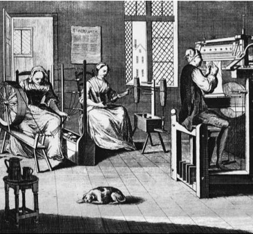
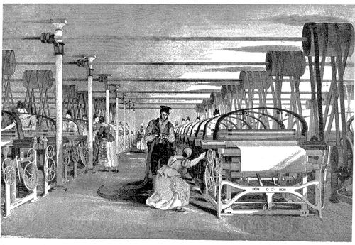

layout: true

<div class="my-footer">
<span>


</span>
</div> 

```{r setup, include=FALSE}
options(htmltools.dir.version = FALSE)

# Insert references
library(RefManageR)
BibOptions(
    check.entries = FALSE,
    bib.style = "numeric",
    cite.style = "numeric",
    style = "markdown",
    max.names = 2
    # hyperlink = FALSE,
)
bib <- ReadBib(here::here("resources/refs.bib"), check = FALSE)
knitr::opts_chunk$set(echo = FALSE)
```

```{r xaringan-themer, include=FALSE}
library(xaringanthemer)
mono_accent(
    base_color = "#2a2e44",
    header_font_google = google_font("Fira Sans"),
    text_font_google = google_font("Crimson Text"),
    code_font_google = google_font("Source Code Pro")
)
```

---

## Reproducible Research is part of several large trends (1)

- Openness
- Transparency
- Quality: reproducibility
- Collaboration / Team work
- Communication

---

## Reproducible Research is part of several large trends (2)

We are in the middle of an exponential growth curve:

- Data production
- Data storage and transfer
- Computing power
- Published research
- Complexity of methods

---

## Reproducible Research is part of several large trends (3)

- Industrialisation of the research work flow
- Specialisation in research tasks

.pull-left[
```{r, out.height="70%", out.width="70%"}

```
]

.pull-right[
```{r, out.height="70%", out.width="70%"}

```
]

---

## Reproducible Research is part of several large trends (4)

.center[
```{r, out.height="55%", out.width="55%"}

```
]

---

## Reproducible Research is part of several large trends (5)

- Changes in the way we work:
	- Remote work
	- Online communities
	- Ad hoc teams

- Research on research:
	- Meta analysis (your output is somebody else's input)
	- Metaresearch: evidence based development of research methods

---

## There are still very strong barriers

- Tools needed
- Tradition, culture and common practices need to change
- Researchers need to see the value in adopting an open, reproducible workflow
- Training and reward systems need to be adapted:
	- Publication
	- Academic recognition / careers
	- Research funding mechanisms
- Law: privacy concerns about sharing data, IP protection, patents, etc


---

class: middle

## Current scientific culture not prepared for analytic and computation era
