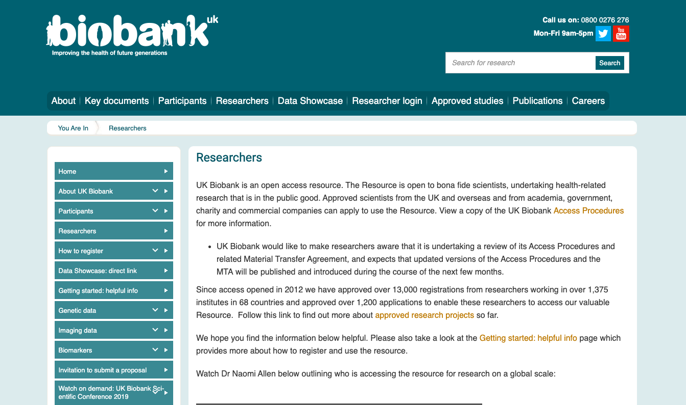
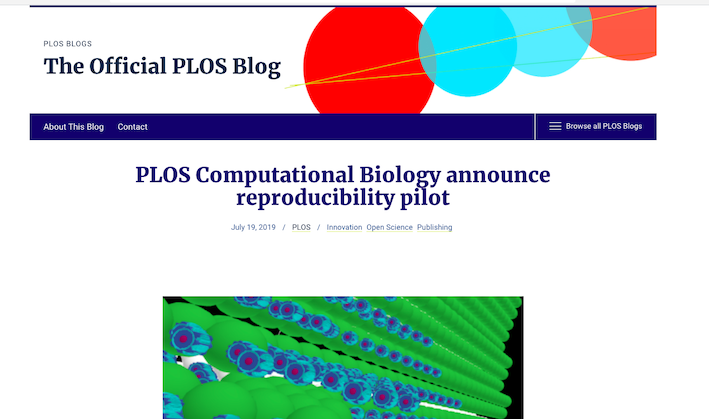
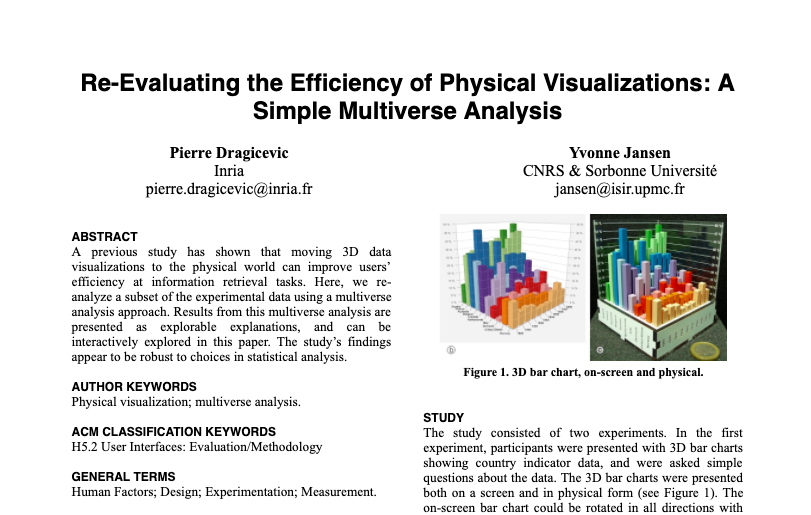

layout: true

```{r setup, include=FALSE}
source(here::here("R/slide-setup.R"))
```

---

## Open Science is part of several large trends

- Openness / Transparency
- Quality: Reproducibility and replicability
- Collaboration / Team work / Remote work
- Communication / Public Engagement / Social Media

---

## Open Science is part of several large trends

We are in the middle of several exponential growth curves:

- Data production
- Data storage and transfer
- Computing power
- Published research
- Complexity of methods (e.g. AI)

---

## Open Science is part of several large trends

- Industrialisation of the research work flow
- Specialisation in research tasks

.pull-left[
```{r, out.height="75%", out.width="75%"}
knitr::include_graphics("../images/Cottage_industry.jpg")
```
]

.pull-right[
```{r, out.height="90%", out.width="90%"}
knitr::include_graphics("../images/Powerloom.jpg")
```
]

.footnote[Figure: [Spinners and stocking makers](https://wellcomecollection.org/works/r9h5us6f) and [Powerloom Weavers](https://en.wikipedia.org/wiki/Industrial_Revolution#/media/File:Powerloom_weaving_in_1835.jpg).]

---

## Open Science is part of several large trends

.pull-left[
```{r, out.height="95%", out.width="95%"}

```
]

.pull-right[
```{r, out.height="85%", out.width="85%"}
knitr::include_graphics("../images/biobank.jpg")
```
]

---

## Open Science is part of several large trends

- Changes in the way we work:
	- Remote work
	- Online communities
	- Ad hoc teams

- Research on research:
	- Meta analysis (your output is somebody else's input)
	- Metaresearch: evidence-based evaluation and development of research methods

---

## How do we move towards reproducibility?

.center[
```{r, out.height="85%", out.width="85%"}
knitr::include_graphics("../images/reproducibility_spectrum.jpg")
```
]


.footnote[[Peng RD. Science 2011. DOI: 10.1126/science.1213847](https://science.sciencemag.org/content/334/6060/1226).]

---

## First computationally reproducible paper (eLife - 2018)

.center[
```{r, out.height="65%", out.width="65%"}

```
]

.footnote[[Lewis LM. eLife 2018;7:e30274 DOI: 10.7554/eLife.30274](https://elifesciences.org/articles/30274).]

---

## Some journals are moving in this direction

PLOS Computational Biology is running a pilot:

*"We will soon be able to offer expert technical peer review specifically checking that submitted systems biology or physiology-based models run according to the results presented in the manuscript submitted to the journal. The peer review will be delivered in addition to our usual scientific assessment.."*

.center[
```{r, out.height="60%", out.width="60%"}

```
]

---

## Developments in making manuscripts interactive

- "[Explorable Multiverse Analysis]" and [example Likert scales]

.center[
```{r, out.height="60%", out.width="60%"}

```
]

[Explorable Multiverse Analysis]: https://explorablemultiverse.github.io/

[example Likert scales]: https://explorablemultiverse.github.io/examples/likert/

---

## There are still very strong barriers

--

- Lack of awareness
- Tradition, culture and common practices need to change
- 'Business as usual' seems the shortest route to success

--

- Tools and training in specific skills needed
- Takes time and dedicated funding

--

- Researchers need to see the value in adopting an open reproducible workflow
- Funding and reward systems need to be adapted:
	- Peer review and Publication
	- Academic recognition / careers
	- Research funding mechanisms

--

- Law: privacy concerns about sharing data, IP protection, patents, etc

---

## Personal barriers

Fear of:

- Scooping or ideas being stolen
- Not being credited for ideas
- Errors and public humiliation
- Risk to reputation
- Reduced scientific quality
- Information overload

.footnote[[Tennant (2017)](https://doi.org/10.6084/m9.figshare.5383711.v1)]

---

class: middle

## Current scientific culture not prepared for analytic and computation era

---

class: middle

## Open science debates and initiatives don't recognize role of software

.footnote[E.g. [EU H2020 Open Science Mandate] only mentions data and publications.]

[EU H2020 Open Science Mandate]: https://ec.europa.eu/research/participants/data/ref/h2020/grants_manual/hi/oa_pilot/h2020-hi-oa-pilot-guide_en.pdf

---

## Little to no training in software or programming

.center[
```{r self-taught-comic, echo=FALSE, out.width="100%", out.height="100%"}
knitr::include_graphics("../images/code-quality.png")
```
]

.footnote[Source from [xkcd](https://www.xkcd.com/1513/).]

---

## Knowing the space and finding an efficient workflow

.center[
```{r, out.height="90%", out.width="90%"}
knitr::include_graphics("../images/tools-workflow.png")
```
]

.footnote[Figure from [Innovations in Scholarly Communication](https://101innovations.wordpress.com/workflows/).]

---

## What does it mean for you?

- Need to stay updated: Keep learning
    - Read [bookdown](https://bookdown.org/) books (most free)
    - Ask (and answer!) questions on [StackOverflow](https://stackoverflow.com/)
    - Teach others!! Great way to learn
    - Read e.g. [Open Science Handbook](https://open-science-training-handbook.gitbook.io/book/)

--

- Find and collaborate with those familiar with these concepts (online and/or in real life)

--

- Cite research that is or tries to be more reproducible

--

- Keep the principles of reproducibility in mind, then find the tools

--

- Practice reproducible and open science
    - More on this later in session
